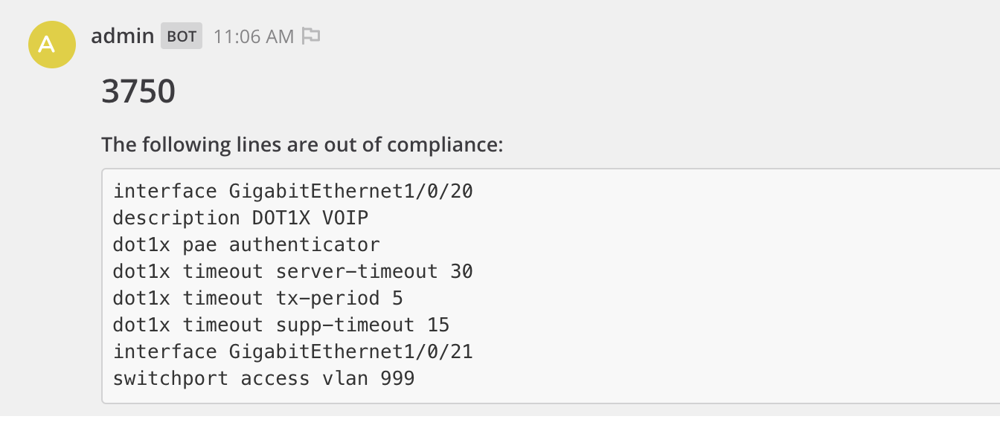

# Configure Dot1x

Demo role to configure dot1x on Cisco switches as well as generate a compliance report for dot1x.

## Requirements

- cisco.ios
- ansible.utils

## Role Variables

- **dot1x_interfaces**: List of interface names to configure dot1x.

  **Example**:

  ```yaml
  dot1x_interfaces:
    - GigabitEthernet1/0/17
    - GigabitEthernet1/0/18
  ```

## Configuration Template

The example template for dot1x configuration is found under roles/configure_dot1x/templates/ios_dot1x.j2. Modify as needed to match your configuration.

## Example Playbook

**Configure Dot1x**:

```yaml
- hosts: all
  gather_facts: false

  vars:
    dot1x_interfaces:
      - GigabitEthernet1/0/17
      - GigabitEthernet1/0/18

  tasks:
    - name: Configure Dot1x
      include_role:
      name: config_dot1x
      tasks_from: ios_dot1x_configure
```

**Generate PortSec Report**:

```yaml
- hosts: all
  gather_facts: false

  vars:
    dot1x_interfaces:
      - GigabitEthernet1/0/17
      - GigabitEthernet1/0/18

  tasks:
    - name: Dot1x Report
      include_role:
      name: config_dot1x
      tasks_from: ios_dot1x_report
```

## Example Report


